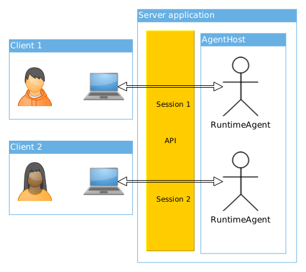
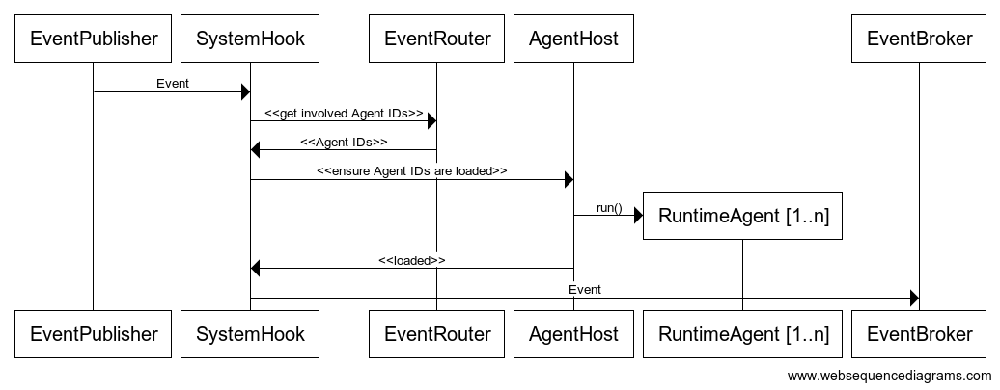

# @abis/server
This package contains the API server and host application for ABIS. 
It brings together all other packages of this repository, 
routes Events and hosts the running Agents and Dialogs.

When running, it provides a GraphQL query- and mutation endpoint at 
[http://localhost:4000](http://localhost:4000) as well as a subscription endpoint at 
[ws://localhost:4000/graphql](ws://localhost:4000/graphql) or any other configured address.  

## API
The complete public API is specified by [src/api/api-schema.graphql](src/api/api-schema.graphql).  
In general, it provides the following mutations, queries and subscriptions:
* **Mutations**:
  * createSession() : CreateSessionResponse
  * send(event:Json!) : SendResponse
* **Queries**:
  * myServer: Server!
  * myProfile: Agent!
  * readEntries(groupId:Int! sort:SortOrder after:String first:Int): EntriesPage
* **Subscriptions**:
  * event: Json!

Authentication is handled via sever-issued JWT tokens, which must be present in the "Authorization" 
header of every API request.  

### Usage  
This section gives you an overview over the GraphQL operations that are used to interact with other _Agents_ on the 
server:  
   
**1) Create a _Session_**  
  
To use the API, you must first create a _Session_:
```graphql
mutation {
    createSession {
        success
        errorMessage
        jwt                 # Contains the JWT which must be included in the 'Authorization' header of
                            # every subsequent process.
    }
}
```
This will give you a JWT token that must be included in the 'Authorization' http-header of every subsequent 
request. The client library creates the session automatically on connect().  

**2) Subscribe to _Events_**  

To receive messages from the server, the 'event' subscription must be used:
```graphql
subscription newEvent
{
    event
}
```
You must provide your session-jwt in the 'authorization'-fields of the connection context. 
The client library does this for you on connect().

When subscribed, the client receives all events that its corresponding _RuntimeAgent_ on the 
server-side receives. These are mostly 'Notifications' but it is not limited to this kind of message.  

**3) Query 'myServer'**   

When you are ready to receive _Events_, you can look for _Agents_ to talk to.
To do that, send a 'myServer' query:
```graphql
query myServer {
    myServer {
        systemAgents {
            id
            name
        }
    }
}
```
This will give you a list of all _Singleton-Agents_ on the server:
```json
{
    "myServer": {
        "systemAgents": [{
            "id": 1,
            "name": "authentication"
        }, ..]
    }
}
```
  
**4) Create a new _Channel_ from your _Profile-Agent_ to the discovered _Singleton-Agent_**

The communication between _Agents_ is usually carried out via a _Channel_. To create a _Channel_, 
you must send a _CreateChannel_-command to the server:    
```graphql
mutation send($event:Json!) {
    send(event: $event) {
        success
        errorMessage
    } 
}
```
The actual _Event_ looks like following:
```json
{
    "_$schemaId": "abis-schema://abis@abis.internal/types/events/commands/createChannel_1_0_0",
    "$jwt": "your-jwt",
    "toAgentId": 1,
    "name": "[my-profile-id] -> [1]",
    "volatile": true
}
```  
When this _Event_ arrives at the server, it will be routed to the _RuntimeAgent_ that represents the
client's _Profile_. So basically what you do is, sending your _Agent_ the _Command_ to create a new 
_Channel_ for you.  

If everything succeeds, your _Profile-Agent_ will send you a new 'NewGroup'-event 
('NewGroup' because a _Channel_ is just a special kind of _Group_) that contains 
all necessary information about the newly created channel:
```json
{
    "_$schemaId": "abis-schema://abis@abis.internal/types/events/notifications/newGroup_1_0_0",
    "id": 123,
    "type": "Channel",
    "owner": [my-profile-id],
    "name": "[my-profile-id] -> [1]",
    "volatile": true,
    "members": [1]
}
```  

**5) Wait for the contacted _Agent_ to respond**

_Channels_ in ABIS are one-way. So currently you can send _Events_ to the discovered "authentication" _Agent_
but have no way of knowing if the other _Agent_ really received and processed your requests.

To receive answers from a contacted Agent, you must wait for it to create an own _Channel_ back to your _Profile_.
When that happens, your profile (and thus the previously established 'events'-subscription) receives
a 'NewMembership' event:
 ```json
 {
     "_$schemaId": "abis-schema://abis@abis.internal/types/events/notifications/newMembership_1_0_0",
     "id": 123,
     "creatorId": 1,
     "memberId": [my-profile-id],
     "groupId": [id-of-the-back-channel]
 }
 ```  
This _Event_ tells your _Agent_, that it was added as a _Member_ to a _Group_. Since you know that you've contacted the 
_Agent_ with the ID '1' before, you can conclude that this is the back-channel from the contacted _Agent_ back to your 
_Profile-Agent_.

**6) Start chatting**

Once both _Agents_ established a _Channel_ to each other (its then called a _DuplexChannel_), they can
exchange Messages until the _Channel_ is closed by one side. The interaction patterns between 
_Agents_ are not fixed but there are some standards which are used throughout the system:

* **askFor**  
The _askFor_1_0_0_ event is sent by an _Agent_ whenever it needs some input to proceed. Depending
on the situation, this could be user-input or the request for data from a different API that is managed 
by some other Agent.  
It is possible for an _Agent_, to send multiple _askFor_1_0_0_ events at once. This usually signals that there
is more than one way to proceed in a process (branch).   

* **retry**  
When an _Agent_ ran into an error during the processing of an incoming _Event_, it can signal this to the other
_Agent_ by sending a _retry_1_0_0_ event. The retry event is only sent when the processing _Agent_ allows retries,
else the processing _Agent_ will send a _return_1_0_0_ _Event_ with a set error-flag. The receiver of this _Event_
is then expected to simply re-send its previous request.

* **return**  
The _return_1_0_0_ _Event_ is sent whenever an _Agent_ wants to signal that a process completed (successful or not). 
It can contain a value that should be considered as the return-value of the process.  
The _return_ event carries an 'isError' flag. When set, the 'result' should be considered as the error object.  

You can send _Events_ to a _Channel_ the same way, you've created it:
```graphql
mutation send($event:Json!) {
    send(event: $event) {
        success
        errorMessage
    } 
}
```
This time however, you need to send a _CreateEntry_1_0_0_ _Command_ to your _Profile-Agent_:
```json
{
    "_$schemaId": "abis-schema://abis@abis.internal/types/events/commands/createEntry_1_0_0",
    "$jwt": "your-jwt",
    "inGroupId": 123,
    "name": "My first 'Entry' in a 'Channel'.",
    "data": {
        "_$schemaId": "abis-schema://abis@abis.internal/types/_lib/interactionPatterns/return_1_0_0",
        "isError": false,
        "result": {
            "_$schemaId": "abis-schema://abis@abis.internal/types/_lib/primitives/text_1_0_0",
            "value": "Thanks. Just wanted to see if someone's at home ;)"
        }
    }
}
```  
This looks a little more complicated at first sight, but it is just objects wrapped one into another:
* **createEntry_1_0_0**:  
  _The main event. It's basically an envelope that tells the recipient (your Profile-Agent) into which group the 
  contained entry should go._
  * **return_1_0_0**:  
  _The actual payload of the createEntry event. In this case a 'return' entry that tells the _Agent_ on the other
  side of the Channel that I want to finish our conversation._
    * text_1_0_0  
    The return value that I've want to send with my 'return' event. Simple text in this case.

**7) Close the channel**  
When you're done, you must close the _Channel_ if it is not intended to stay open 'forever'
(e.g. like in a person to person chat between friends).
  
Again, send a new _Event_:
```graphql
mutation send($event:Json!) {
    send(event: $event) {
        success
        errorMessage
    } 
}
```
This time with a _CloseChannel_ _Command_:
```json
{
    "_$schemaId": "abis-schema://abis@abis.internal/types/events/commands/closeChannel_1_0_0",
    "$jwt": "your-jwt",
    "channelId": 123
}
```  

## Fundamentals
The server application is built from two major parts: 
* the GraphQL API which is built on top of [Apollo Server](https://www.apollographql.com/docs/apollo-server/)
* the [ABIS Server](src/core/abisServer.ts) that hosts all _Agents_ and the _Event_ system

Both are started in the "run()" method of [main.ts](src/main.ts) and then run mostly independent of each other.

### GraphQL API
The main purpose of the API is to provide access to the _RuntimeAgent_ that represents the user.
  
!
  
It can further be used by a client to query all its _Groups_ (the own, and the ones where it is a member of) as well as 
the _Entries_ within it. 

At start-up, the server loads the complete api schema from [src/api/api-schema.graphql](src/api/api-schema.graphql).   
The actual implementation of the API can be found in [src/api/apolloResolvers.ts](src/api/apolloResolvers.ts).

See the Apollo Docs for more details on how _Resolvers_ etc. work.

### AbisServer
The ABIS Server mainly hosts the different runtime representatives of Singleton-, Profile- and Companion-Agents
and allows them to communicate with each other. It's source can be found at [src/core/abisServer.ts](src/core/abisServer.ts) 
and it consists of different components that should be described shortly:

* **AgentHost**  
  The [AgentHost](src/core/agentHost.ts)'s sole responsibility is to start _[RuntimeAgents](../agents/src/runtimeAgent.ts)_ 
  on request. It uses the [AgentFactory](src/core/agentFactory.ts) to create a new instance of the requested _Agent_ and 
  then calls its 'run()'-method to start it. Once the _Agent_ is started, it is ready to receive _Events_.
  Every Agent (distinguished by ID) can only be started once.

* **AgentFactory**   
  In ABIS, every Agent in the database has a 'implementation' field. The [AgentFactory](src/core/agentFactory.ts) is 
  responsible to load an Agent from the database by its ID and then to create an instance of its implementation. 
  The 'implementation'-value must point ot a valid filesystem path which is then loaded with NodeJS's import()-function. 
   
* **EventRouter**  
  The [EventRouter](src/core/eventRouter.ts) acts as a lookup-service that knows which Agent should be notified about 
  what Event. To determine the recipients of an Event, the EventRouter can deep-inspect some known event types and parse 
  their fields for e.g. Agent-IDs. It then creates a list of Agent-IDs from the collected information and returns it
  to the caller.   
  
  _Since not every Event is routable, own application protocols must be created on top of the basic routable events 
  that come with ABIS. These include all [notification](../types/src/schemas/abis/types/events/notifications) and 
  [command](../types/src/schemas/abis/types/events/commands)-event types._
  
* **SystemHook**  
  The [SystemHook](src/core/systemHook.ts) "hooks" into the server's event stream and sends every incoming Event to the 
  EventRouter. It then takes the recipient list it got and passes it on to the AgentHost to make sure, every Agent
  that is affected by the currently inspected event, is loaded.
  
* **EventPublisher**  
  The _EventPublisher_ is where the server's event stream ultimately starts. Every component of the system must publish 
  its _Events_ via this publisher.
  
* **EventBroker**  
  This is the only component in this list that's not exclusive to the ABIS Server. 
  It generally manages event streams by a topic-ID and is used by the server to deliver incoming events to their 
  corresponding Agents. The ID of the _Agent_ is used as topic ID. It utilizes the _EventRouter_ to find the right
  topic IDs.
  
### Implementation details
The server must make sure, the implementation of the _Agent_ which is about to receive an _Event_, is loaded when the 
event arrives at the server's _EventBroker_.
To do that, all _Events_ that arrive at the server's _EventPublisher_ are redirected to the _SystemHook_ 
first (see AdapterPublisher).  

The _SystemHook_ then asks the _EventRouter_ for the IDs of all _Agents_ that are involved
with this _Event_. It then passes that list on to the _AgentHost_ with the order to make sure, that all _Agents_ on
this list must be loaded. The _AgentHost_ then starts the _RuntimeAgents_ if necessary.  

When all Agents have been loaded, the _SystemHook_ passes the _Event_ on to the server's _EventBroker_. 

  

